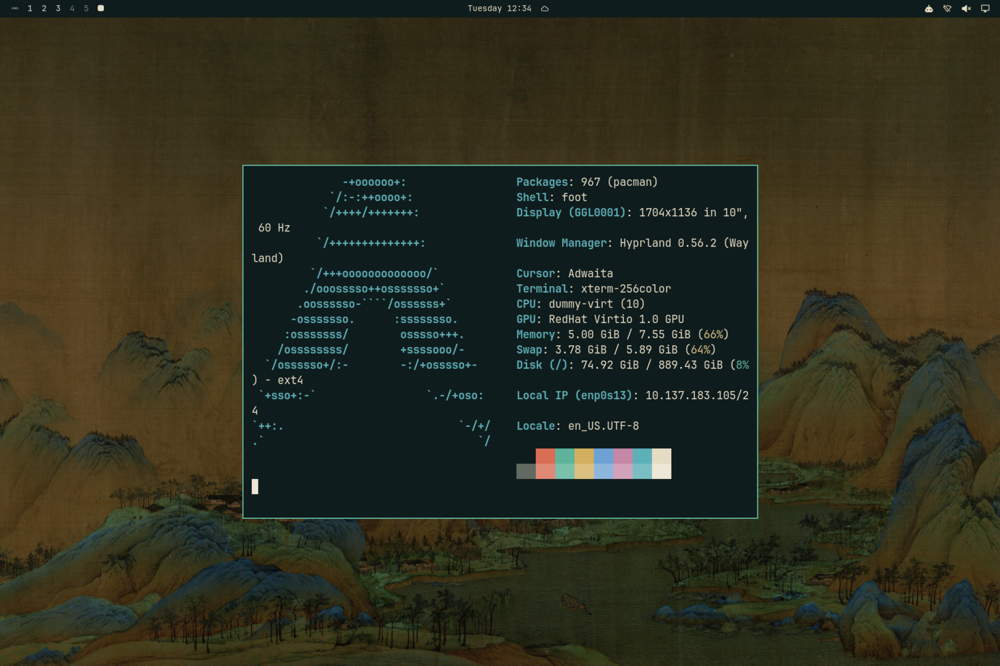

# 千里江山·夜 Qianli Jiangshan Night

深青绿为底、绢色为字、石绿为印的深色主题，壁纸为《千里江山图》适度压暗，浅色版为 qianli-jiangshan。



## 安装

```bash
omarchy theme install https://github.com/rwanglq-ctrl/omarchy-qianli-jiangshan-night-theme
```

## 壁纸来源

1. 王希孟《千里江山图》群峰局部，北宋，故宫博物院（公有领域，图像来自 Wikimedia Commons）
2. 王希孟《千里江山图》山湖局部，北宋，故宫博物院（公有领域，图像来自 Wikimedia Commons）
3. 王希孟《千里江山图》卷首局部，北宋，故宫博物院（公有领域，图像来自 Wikimedia Commons）

## 许可

- 壁纸：古画为公有领域作品，不受限制
- 配色与配置文件：MIT

详见 [LICENSE](LICENSE)。
